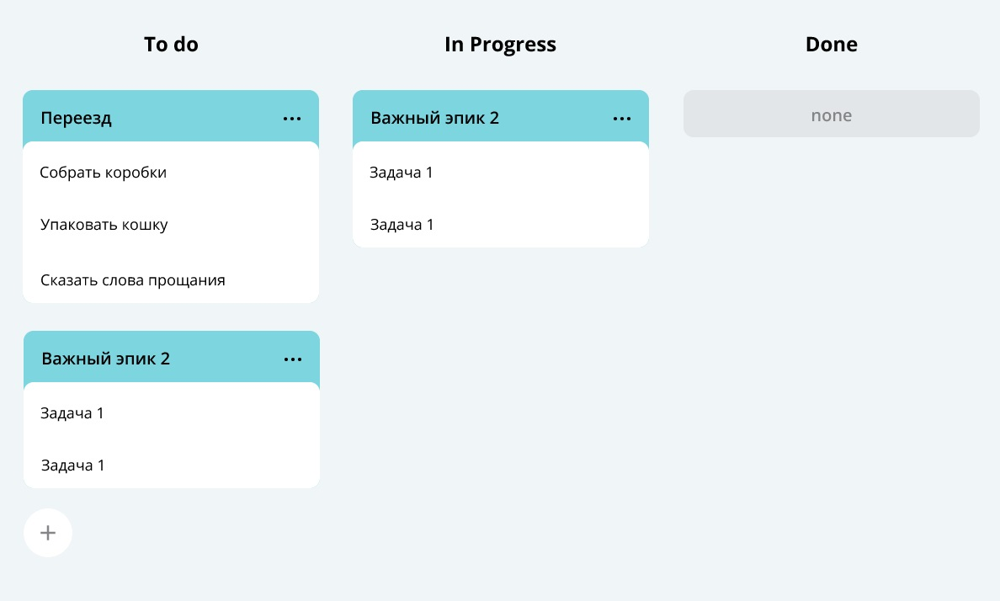

# Java kanban

is a backend for a task tracker that allows you to create, modify, track tasks. Kanban is originally a work organization system that appeared in Japan in the late 1950s. This is a board with columns and cards.

The cards are the tasks of the team, and the columns are their statuses. Tasks can be both simple and consisting of several subtasks. The loading and unloading of the entire structure of tasks and subtasks into a file has been implemented.

*Application is written in pure Java, without the use of frameworks.*